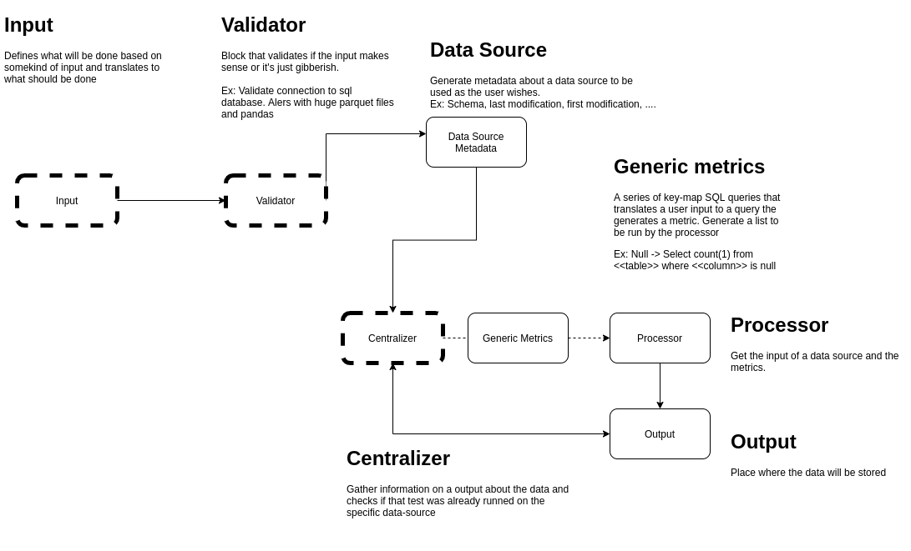

# Decouple Data Monitoring, Information and democratization

The purpose of this project is to create a decoupled infraestructure of data monitoring, testing, information or other.
Since the last frameworks of data test that used  was very "coupled" and adding a simple feature was difficult I'm trying to create something less monolithical.

In the future the idea is to have a bunch of microservices that can easily be call and this can be a "Data Center" of testing and other stuff.
This can be facilitated by using airflow 2.0 apis or other Cloud apis.

Initial Architecture:

## V0.1 

Following the premises of the MVP Piramid the first version will be a very simple generic metrics generator, features:
1. It will only work for single small files (Pandas);
2. It will only work with local data;
3. It will follow OOP but all the functions of the classes will follow FP.
4. It will do only 3 metris nulls count, distinct, counting the values on the columns.
5. All the components will communicate as hashmaps (dictionaries in this case).
6. It will output as a local file

Reasons:
1. Easier to generate metadata;
2. No complexy of libraries;
3. Easier to convert into a better perfomance FP language;
4. Simplistic;
5. Easy to convert to json;
6. Same as 2;
